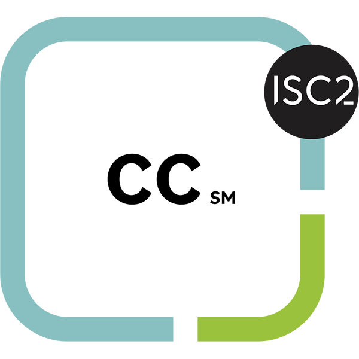

# Demi Awe

 I'm a skilled DevOps and Cloud Engineer who can work with multiple technologies and quickly learn and master new ones.
 Experienced in writing shell scripts to automate the build and deployment of Java,Php, React, and Python code applications.
 Proficient in C, C++, and C# programming languages with familiarity in Jira and Azure DevOps for tracking workflow.
 Demonstrated ability to work with minimal supervision to complete projects involving designing websites and performing unit, system, and usability testing on the projects.
 
 

  
   

 

---

### Projects

 
 

  

    
    
    
    
    

 
 

### Certifications

  

 
 

### Cloud Providers

<a href="https://www.heroku.com/">

  
 
 

### Programming Languages and Scripting

 
 

### Tools

 
 

### VCS & CI/CD

 
 

### Infrastructure as Code

 
 

### Monitoring, Logging, & Testing

 
 

### Project Management

 
 

### Databases

 
 
 

### Markup

 
 

### Stats

    

 
 

---

### My Journey
   I started out as a student of Mechanical Engineering who loved gadgets and electronics a little too much, so I would look for ways to improve them and make them way better than they were designed to perform (e.g. overclocking graphics cards and processors, porting drivers from one device to another, upgrading hardware, etc). I already knew how to repair electronics and make custom electronics such as power amplifiers, sound equalizers, active filters (sallen-key, butterworth, chebyshev), and all sorts of other DIY electronics.
  I got very interested in mobile phones so I started working on them in the days of Android Eclairs and iPhone 4. While testing custom ROMs on Android phones and jailbreakking iPhones, I was introduced to Python 2, Android Debugging Bridge (ADB), JTAG, and Linux (Ubuntu).
  I was able to implement projects such as E-learning systems for companies with the knowledge of Linux and Python 2 that I had, then I switched to PHP and WordPress because it looked interesting to me. I transitioned afterwards to writing desktop apps with C# and packaging them with InstallShield. This wasn't long-lived as I later switched to JavaScript (React and Node.js) and Java. 
  My switch to DevOps happened over 5 years ago when a mentor gave me a Raspberry Pi 3b+ and asked me to run experiments on it and try to break it. I made many projects with it (one of them is Raspotify), then I got to the point where I was able to host a static website on it, and eventually run Kubernetes (MicroK8s). That's how my DevOps Journey started.
  
 
 

